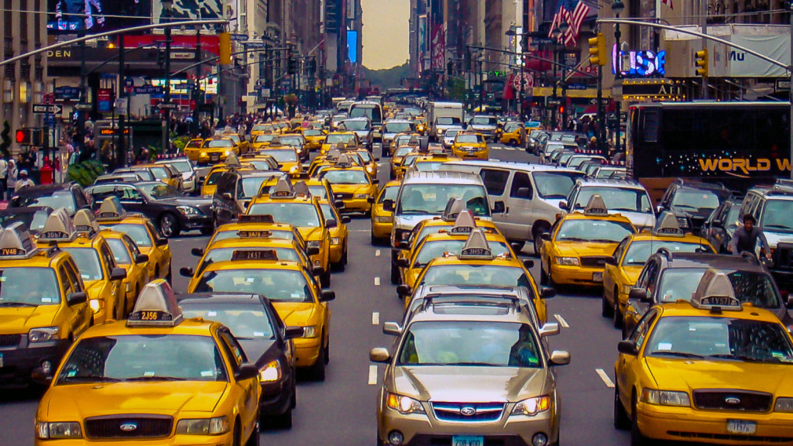

# Taxi demand prediction in New York City

</img>

This ipython notebook is developed to predict the taxi demand for yellow cabs in new york by applying differnt machine learning algorithm. A step by step analysis has been done on the data provided by the Taxi & Limousine Commission for yellow cabs. Based on the data provided, the machine learning model predicts the taxi demand in 10 minute time frame regionwise.

Data Source:<a href="https://www1.nyc.gov/site/tlc/about/tlc-trip-record-data.page">https://www1.nyc.gov/site/tlc/about/tlc-trip-record-data.page</a>

Data Dictionary
- pick-up and drop-off dates/times,
- pick-up and drop-off locations,
- trip distances,
- itemized fares,
- rate types,
- payment types,
- driver-reported passenger counts

With the provided data, we will first clean the data to get data in required format followed by exploratory data analysis.

We will use K-Means clustering algorithm to divide the NYC regionwise so that we can do regionwise prediction.

Feature importance is one of the most important aspect in machine learning. We will do this using below method.
- Moving Averages
- Weighted Moving Averages
- Exponential Moving Averages

After this we will be applying different reggression model having optimized hyperparameter. The 
- Linear Regression with GridSearch
- Random Forest Regressor with Random search
- XgBoost Regressor with Random search

__Objective: By comparing the different model we will select the best model to predict the Yellow Taxi demand which helps the taxi drivers.__

This project is developed with the help of videos and basic code provided by appliedaicourse.com.
